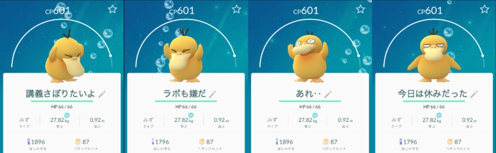
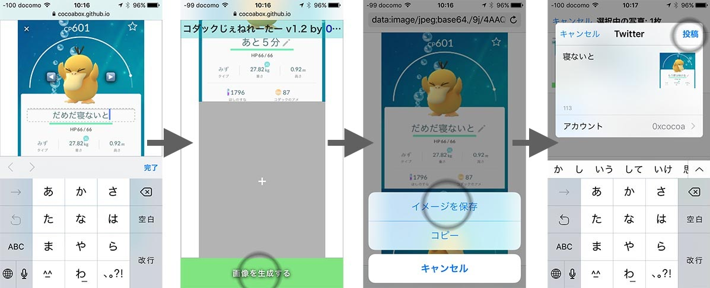

# 「コダックジェネレーター」とは？
最近ツイッターではやってるコダックこら画像の生成ツールです。
任意のコマ数を設定できます。画像は 14 種類用意してあります。
すぐ使いたい人は(☞ ՞ਊ ՞)☞ [ここまで](https://cocoabox.github.io/psyduck_maker/)

# サンプル

# 使い方
1. **[index.html](https://cocoabox.github.io/psyduck_maker/)** を開きます。
2. 【＋】を押してコマを追加します。
3. 【◀】や【▶】を押して好きな画像を選びます。
4. タイトルをクリックして変更します。
5. 画面一番下の【画像を生成する】をクリックして画像を表示します。新しいタブが開きます。
6. 画像をファイルとして保存するには、[⇧Shift]キーを押しながら【画像を生成する】をクリックします。

## スマホでの使い方

1. **[index.html](https://cocoabox.github.io/psyduck_maker/)** を開き、ネタを作成します。
2. 【画像を生成する】をクリックして画像を表示します。
3. 画像をスマホに保存します。
4. 画像を開いて、Twitterで共有します。

# FAQ

**Q. コマ数多すぎるとどうなる？**   
A. 改行します

**Q. 全部一行で表示したい。**  
A. 窓をリサイズしてください。

**Q. ◀と▶を押しても画像が変わらない…**  
A. 画像のローディングにちょっと時間かかります。押してから数秒待ってください。

**Q. 他の画像を使いたい。**  
A. チェックアウトして _00.png_, _01.png_, ...などを入れ替えてください

**Q. 直接ツイートしたいけど。**  
A. これはローカルPCで使うツールで、サーバへの通信はしません。画像を保存して、ツイートしてください。

**Q. ローカルで走らせたい**  
A. いいよ(；・∀・)

**Q. ライセンスは？**  
A. ポケモンの著作権は任天堂、ポケモンGO は Niantic, Inc. が所有しています。コードはうち所有で、MITライセンスです。
 